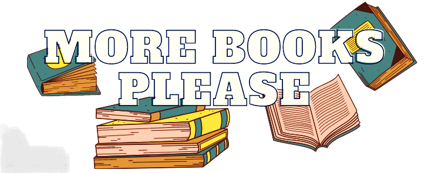

 
# AMAZON BOOK RECOMMENDATION SYSTEM

## BUSINESS UNDERSTANDING

## OVERVIEW

## Main Ojective

## Specific Objectives

## Data Understanding

## Models Implemented

## Evaluation

## Findings

## Recommendations

## Author and Aknowledgement:
Special thanks to our Moringa School Data science Techincal Mentors for their guidance throughout the process of our project and the amazing Elites team members 👇

Ronald Nyagaka

Sharon Sonia

Pamela Awino

Isaac Muturi

Leonard Rotich

Paul Musau

